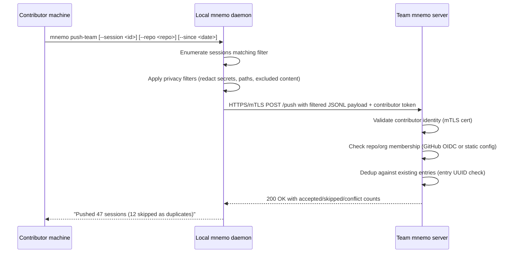
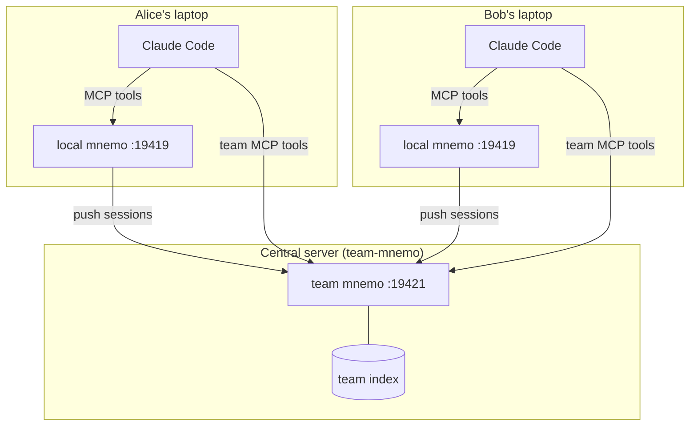

# Team-mnemo Design

*Status: design draft — 2026-04-25. Tracked as 🎯T36.*

---

## Problem statement

mnemo today is a single-user tool. Every contributor on a repo runs their own
daemon, their own index, their own transcript store. When a newcomer joins a
program of work, or a senior contributor context-switches back after two weeks
away, they face archaeology: read Slack threads, scan PR descriptions, grep
commit messages. The collective knowledge of the team's working sessions is
siloed on individual laptops.

The goal of team-mnemo is to give a team a shared, searchable index of their
collective working sessions, so that a newcomer can query "what is the state of
the authentication refactor?" and get a substantive answer drawn from weeks of
real sessions rather than just git log.

---

## What this is not

Before getting into the design, it is worth being precise about scope.

**Not a collaboration tool.** Team-mnemo is a read-mostly knowledge base. It
does not synchronise live sessions, enable real-time shared context, or support
multi-user agent workflows. It is more like a searchable shared notebook than a
shared editor.

**Not a transcript backup service.** The goal is enabling onboarding and
cross-contributor context, not ensuring that every contributor's sessions are
durably archived. Those are compatible goals but different constraints; this
design optimises for the former.

**Not a replacement for per-user mnemo.** Every contributor continues to run
their own daemon for their own MCP tools. The central instance augments that
with team-scope search; it does not replace the personal index.

---

## Relationship to 🎯T15 federation

T15 federation is **peer-to-peer read fanout**: each contributor keeps a
sovereign local index and queries multiple peers in parallel at read time.
There is no writeable shared state; each instance is authoritative for its
own transcripts.

Team-mnemo is **write-aggregation to a shared store**: contributors push
transcript content to a central index that is the canonical surface for
team-scope queries. The central instance is authoritative for the team's
collective history.

**Recommendation: team-mnemo is a distinct shape from T15 federation,
not a special case of it.**

Here is the reasoning:

1. **Data flow is different.** T15 pulls at read time (fan-out queries). Team-mnemo
   pushes at write time (ingest). A "team peer" in T15 terms would receive
   every query from every contributor's MCP session — that is unnecessary
   network traffic and couples every contributor's read latency to the central
   server's availability. Push-once/read-many is more appropriate for a shared
   knowledge base than fan-out-every-query.

2. **Attribution is a first-class concern.** In T15, `FanoutEnvelope` attributes
   results by the instance that produced them, but the underlying entries are
   anonymous within each instance (they all belong to the instance owner). In
   team-mnemo, every entry must carry the contributor who produced it, because
   "who worked on this?" is a core query. That requires a new `author` dimension
   on ingested entries, not just envelope attribution.

3. **Access control is different.** T15 peers are private machines — you only
   link to peers you control. The central team instance is potentially accessible
   to the whole org, including people who should not see sensitive sessions. T15
   has no access control model; team-mnemo needs one.

4. **The composition is still possible.** A contributor can run T15 federation
   across their own machines AND register the team central instance as an
   additional peer. But the team central instance is a different kind of peer —
   it accepts writes, enforces per-contributor attribution, and applies access
   policies. That is not the T15 peer model.

**Practical implication:** team-mnemo reuses the mTLS endpoint machinery from
🎯T15.1 for transport security, but introduces a distinct push protocol,
a distinct API surface for receiving pushed sessions, and a distinct author-aware
query layer. It does not run over the existing `:19420` federated endpoint.

The composition sketch:

```
                    per-contributor laptop
                   ┌──────────────────────────────────┐
                   │   per-user mnemo (:19419)         │
                   │   ┌───────────────────────────┐   │
                   │   │ local transcript index    │───┼──► MCP tools to Claude Code
                   │   └───────────┬───────────────┘   │
                   │               │ push (new target)  │
                   └───────────────┼────────────────────┘
                                   │ HTTPS + mTLS
                                   ▼
                         central mnemo server
                         (team-scope index)
                         ┌──────────────────────┐
                         │  multi-author index  │
                         │  author-aware tools  │─► MCP tools to any contributor
                         └──────────────────────┘
```

---

## Deployment model

### Who runs the central instance?

The central instance is **self-hosted**, run by the team or org itself.
A hosted SaaS tier is a future option but not part of this design, for reasons
covered in the [Privacy](#privacy) section.

Practical deployment options in order of simplicity:

1. **A dedicated Linux server or VM** — the same binary (`mnemo`), the same
   daemonisation (systemd or brew services), a different address and a different
   data directory. Recommended for teams of more than a handful of people.

2. **One team member's always-on machine** — simpler operationally, but the
   team's ability to query depends on that machine's uptime. Fine for a small
   team that all keep machines on during working hours.

3. **A container** — `mnemo` runs from a container image with a mounted volume
   for the database and index. No code changes needed; standard container
   orchestration handles uptime and restarts.

The binary is the same in all cases. There is no "central mode" flag; the
central instance is distinguished by how contributors interact with it (push,
not just query) and by what is in its index (multiple contributors' sessions,
not just one).

### Discovery

Contributors discover the central instance via their project's `CLAUDE.md`
(or a team-level config file). The central instance URL and its public cert
PEM are checked into the repo so that `git clone` is sufficient to onboard.

Concrete mechanism: a new `team_instance` key in `~/.mnemo/config.json` (or
in a project-level `.mnemo/config.json` that takes precedence):

```json
{
  "team_instance": {
    "name": "team",
    "url": "https://mnemo.myteam.example:19421/mcp",
    "peer_cert": "team-mnemo"
  }
}
```

The `mnemo onboard-team` subcommand (proposed) reads the project's
`.mnemo/team.json` from the repo root and writes the relevant entries into
the user's `~/.mnemo/config.json`. This is the same UX pattern as `mnemo
register-mcp` — one command, no manual JSON editing.

### Relationship to per-user Registry (🎯T32)

The per-user Registry (shipped in v0.25.0) is the routing layer that maps
`?user=<name>` on the MCP URL to the right user's Store on a shared daemon
host. It addresses multi-user on a single physical machine (e.g. Windows
LocalSystem service routing to per-user stores).

The team central instance is a different concept: it is a single Store that
deliberately aggregates multiple contributors' sessions, with author metadata
attached to each entry. It does not use the Registry's per-user routing —
it has one store that belongs to the team, not one per contributor.

On the contributor's machine, the per-user Registry is irrelevant for
team-mnemo (contributors still have their own per-user daemon). On the central
server, the Registry is also irrelevant — there is one store, one user
(the daemon's service account), and it receives pushes from multiple external
contributors rather than routing local MCP requests to per-user stores.

---

## Push protocol

### What gets pushed

**Recommendation: push session entries scoped by repo, on a per-session basis,
contributor-opt-in per session.**

The granularity choices and rationale:

- **All entries vs. repo-scoped**: pushing all transcripts from all repos would
  flood the central index with content irrelevant to the team. Repo-scoped push
  is the sensible default. A contributor working on `myorg/backend` pushes
  sessions where `session_meta.repo` matches `myorg/backend` (or any repo in
  the org, depending on team config).

- **Session-level granularity**: push the full session, not individual messages.
  Sessions are the natural unit for attribution and dedup (each session has a
  stable UUID). Partial-session pushes complicate conflict detection without
  meaningful benefit.

- **Which content within a session**: push message content (text, tool_use,
  tool_result, thinking) but apply the [privacy filters](#privacy) before
  transmission. The pushed payload is a filtered JSONL subset, not a raw copy.

- **Branch scope**: branch-scoped push (only push sessions from the feature
  branch you're working on) is a natural extension but adds complexity to the
  initial design. It is listed as a sub-target (🎯T36.4) rather than a day-one
  requirement.

### What triggers a push

**Recommendation: on-demand subcommand as the primary trigger, with a git hook
as an optional convenience.**

Three options considered:

| Option | Pros | Cons |
|--------|------|------|
| On-demand subcommand (`mnemo push-team`) | Explicit contributor control, easy to audit, no ambient side effects | Requires deliberate action; easy to forget |
| Background watcher (automatic push on session close) | No manual step | Privacy risk (contributor may not notice something was pushed), hard to cancel once sent |
| Git hook (push to origin triggers mnemo push-team) | Natural integration with existing workflow | Delays the git push, fails silently if mnemo is down, couples unrelated operations |

The background-watcher option is unsuitable given the privacy considerations.
Automatic upload of session transcripts without explicit contributor action is
the same pattern that makes telemetry contentious, and mnemo transcripts are
far more sensitive than typical telemetry.

The git hook option is attractive but should be opt-in. The recommended
implementation: `mnemo install-team-hook` adds a `post-push` git hook to the
repo that runs `mnemo push-team --session-filter repo=<current-repo>` after a
successful `git push`. Contributors who want automatic push install it; those
who do not, push manually.

**Push trigger sequence:**



### Author attribution

Each pushed session is tagged with the contributing author at ingest time on
the server. The server identifies the contributor via the mTLS client certificate
presented during the push (the same cert generated by `mnemo print-endpoint`).

The cert's `CommonName` field currently takes the form `mnemo-<hostname>`, which
is not a stable contributor identity (hostnames change, multiple machines per
contributor). Two options:

1. **Extend the cert generation** to include a `SubjectAltName` email or a
   custom OID carrying the contributor's GitHub username or email. This is set
   at cert generation time and persists for the cert's lifetime. `mnemo
   print-endpoint --contributor alice@example.com` would embed the identity.

2. **Out-of-band identity claim** in the push HTTP header: the contributor
   includes their GitHub username or email in a `X-Mnemo-Author` header; the
   server validates the claim against the GitHub org membership (see
   [Access control](#identity-trust-and-access-control)) and treats it as the
   authoritative author if valid.

**Recommendation: option 2 (out-of-band header) for the initial design.**
Embedding identity in the cert requires regenerating the cert when a user
changes email or username, and the cert's 10-year lifetime makes that awkward.
An HTTP header is easier to update and is already validated by the server's
authorization check, so it does not create a new trust surface — the server only
accepts the author claim from a contributor who already passed the mTLS
handshake.

The server stores `pushed_author` as a new column on the team-mnemo entries
table (not on the standard `messages` or `entries` tables, which are single-user
by design).

---

## Pull and query model

**Recommendation: contributors query the central instance directly via MCP,
registered as a second MCP server alongside their per-user daemon.**

Three options considered:

| Option | Pros | Cons |
|--------|------|------|
| Direct MCP query to central | Simple client; no local storage overhead; always reflects latest pushes | Requires network to central; central's uptime matters for queries |
| Sync-down read-only mirror | Offline-capable; local query speed; no query traffic to central | Large sync size; stale data; complex sync protocol; duplicates local storage |
| Federation fan-out (T15 style) | Reuses existing machinery | Every query fans out to central; couples read latency to central uptime; see T15 shape discussion above |

The direct-query model is the right default. Mnemo is already a network-backed
service (the local daemon serves HTTP MCP); adding a second MCP server for
team-scope queries is natural. Contributors who need offline access can read
their local per-user index; team-scope queries sensibly require connectivity
to the team server.

**Registration:** contributors register the central instance as a second MCP
server in Claude Code:

```bash
claude mcp add --scope user --transport http mnemo-team https://mnemo.myteam.example:19421/mcp
```

This gives Claude Code two sets of mnemo tools: `mnemo_*` (local, personal)
and `mnemo_team_*` (team, shared). Tool naming is TBD — the simplest approach
is a namespace prefix in the server's tool name registration, so the central
server exposes `mnemo_team_search`, `mnemo_team_sessions`, etc. This avoids
tool name collisions without requiring any client-side routing logic.

**Author-aware tools:** the central instance's tools accept an optional
`author` filter parameter so contributors can ask "what did alice work on last
week?" as well as "what did the team work on regarding authentication?".

---

## Identity, trust, and access control

### Authentication

**Recommendation: mTLS client certificate from T15.1, extended with an
out-of-band author claim validated against GitHub org membership.**

The mTLS infrastructure from T15.1 (self-signed ECDSA P-256 certs, peer trust
store at `~/.mnemo/peers/`) provides transport-layer authentication: only a
contributor whose cert the server trusts can connect at all. This is the right
foundation because:

- The machinery already exists (no new auth protocol to implement).
- Self-signed peer-pinning scales naturally to small teams without requiring a
  PKI or CA.
- mTLS gives mutual authentication — the server knows who is calling, and the
  client knows it is talking to the real team server.

For larger teams or orgs where manually distributing per-contributor certs is
impractical, a GitHub OIDC flow is the natural extension: contributors present
a short-lived GitHub Actions OIDC token (or a `gh` CLI–obtained OIDC token) as
an HTTP Bearer token alongside the mTLS connection. The server validates the
token against GitHub's JWKS endpoint and extracts org membership claims.

**Recommendation: start with mTLS-only for the initial implementation; add
GitHub OIDC as a follow-on target (🎯T36.6).**

### Onboarding a new contributor

The team admin runs:

```bash
# On the central server side: trust the new contributor's cert
cp alice.pem ~/.mnemo/peers/alice.pem
mnemo reload-peers  # or restart the daemon
```

The contributor runs:

```bash
# On their laptop: learn the team server's cert and URL
mnemo onboard-team --config .mnemo/team.json
# This writes ~/.mnemo/config.json team_instance entry
# and sends their own cert to the server (or outputs it for the admin to install)
```

This is the same distribute-by-paste workflow as T15's `mnemo print-endpoint`.
For teams using GitHub OIDC, the manual cert exchange is replaced by the OIDC
trust model.

### Read vs write permissions

The central instance enforces two permission levels:

- **Push (write)**: any contributor whose mTLS cert is in the trusted-peers
  store (or whose OIDC token validates org membership) can push sessions.
  Write is bounded to "push your own sessions" — the API does not expose
  arbitrary write, delete, or session modification.

- **Query (read)**: any authenticated contributor can read. There is no
  per-session read ACL in the initial design. If a contributor pushed a session,
  any team member can query it.

**Compartmentalisation escape hatch:** a contributor can mark a session as
private before pushing by creating a `.mnemo-push-exclude` file in the repo or
by including a `# mnemo: private` marker in a CLAUDE.md session note. Sessions
marked private are never pushed, regardless of push filter settings.

### Containing a malicious or compromised contributor

The threat model: a contributor whose cert is trusted (or whose OIDC token
validates) pushes intentionally misleading or poisoned session content to
corrupt the team's shared memory.

Mitigations:

1. **Immutable append-only log**: pushed sessions are never overwritten. Each
   push creates new entries; existing entries cannot be modified after upload.
   Poisoned entries can be identified by `pushed_author` and removed by an admin
   via a new `mnemo admin-purge --author <id>` subcommand.

2. **Attribution at query time**: every result from the team index includes
   `pushed_author`, so agents and users can calibrate trust by contributor.
   A newly joined contributor's sessions can be treated with more skepticism
   by the querying agent.

3. **Cert revocation**: removing a contributor's cert from `~/.mnemo/peers/`
   and restarting the daemon prevents future pushes from that contributor.
   Existing entries remain; admin purge removes historical content.

4. **Rate limiting**: the push endpoint enforces a per-contributor push rate
   limit (e.g. 100 sessions per hour) to limit the blast radius of a
   compromised cert.

---

## Privacy

Transcript content is intimate. Sessions contain stream-of-consciousness
debugging, exploratory reasoning, API keys that flashed through a terminal,
local file paths, half-formed ideas, and personal opinions. The design must
make it possible to share useful context without forcing contributors to share
everything.

### What is uploaded by default

When a contributor runs `mnemo push-team`, the following content is pushed
for each matching session:

| Content | Pushed? | Notes |
|---------|---------|-------|
| Tool result text | Yes, filtered | Secrets redacted (see below) |
| Assistant message text | Yes | The reasoning and answers |
| User message text | Yes | The queries and context |
| Tool_use inputs | Yes, filtered | Command args, file paths redacted |
| Thinking blocks | **No** | Extended thinking is not pushed — too private |
| Images | **No** | Not pushed in initial design; images may contain sensitive screen content |
| File paths under home dir | Redacted | Paths like `/Users/alice/work/...` become `~/.../...` |
| Environment variables from tool output | Redacted | Anything matching `[A-Z_]{4,}=...` in tool results |
| Tokens and API keys | Redacted | Pattern: 40+ char alphanumeric strings in known token formats |

The redaction pipeline runs on the contributor's local daemon before transmission.
The server never receives unredacted content.

### Secrets redaction

The redaction pipeline applies a set of pattern-based and structural rules:

- **Known secret patterns**: AWS access keys (`AKIA...`), GitHub tokens
  (`ghp_...`, `github_pat_...`), Anthropic API keys (`sk-ant-...`), generic
  Bearer tokens.
- **High-entropy strings**: strings of 40+ characters that are not in a
  common dictionary and match the character distribution of encoded secrets.
  These are replaced with `<REDACTED>`.
- **Environment variable values in tool output**: when `tool_result` content
  includes lines matching `KEY=value` where `KEY` is uppercase and long,
  the value is redacted.

The redaction pipeline is configurable: contributors can add custom patterns
to `~/.mnemo/push-redact.yaml`. Common use case: redacting project-specific
identifiers (internal hostnames, service account names) that should not leave
the machine.

### Opting a session out

**Before pushing** (proactive opt-out):

```bash
# Tag a running or completed session as private
mnemo session-privacy --session <id> private
# Or: add a marker to the CLAUDE.md that Claude Code will pick up
```

A `.mnemo-push-exclude` file in a repo root causes all sessions in that repo
to be excluded from push by default. This is useful for repos containing
proprietary client work or other sensitive material.

**After pushing** (reactive opt-out):

Contributors can request deletion of a pushed session:

```bash
mnemo team-retract --session <id>
```

This removes the session's entries from the team index and is available to
the contributor who pushed the session (not to other team members). The admin
can also retract on behalf of a contributor.

### Thinking blocks and images

Thinking blocks (`type: thinking` in the transcript) are never pushed. They
contain the model's internal reasoning which is often exploratory, repetitive,
and unpredictable in content. They add noise to team search and may contain
content the contributor did not intend to share.

Images are not pushed in the initial design. Images may contain screenshots
with sensitive content (unreleased UI, confidential documents, error traces
with API keys). A future iteration could push images with explicit per-image
opt-in confirmation.

---

## Conflict and dedup

### Same session pushed twice

Each session has a stable UUID (the JSONL filename's `session_id` field).
The push protocol sends the session UUID as part of the payload. On receipt,
the server checks whether a session with that UUID already exists in the team
index, attributed to the same `pushed_author`.

- **Exact duplicate** (same UUID, same author, same entry count): silently
  skip. Return the session UUID in the `skipped` list of the push response.

- **Session with new entries** (same UUID, same author, more entries than
  stored): append the new entries. This handles the case where a contributor
  pushes partway through a session and then pushes again after more messages
  were exchanged.

- **Same UUID, different author**: this should not happen in a correctly
  functioning system (session UUIDs are generated by Claude Code and are
  globally unique). If it does, reject the push with a conflict error and
  log the collision for admin review. Do not overwrite.

### Sessions edited after upload

mnemo's ingest pipeline is append-only at the message level: existing entries
are never rewritten. Post-upload changes (compaction summaries, tool-result
rewrites by Claude Code) do not automatically propagate to the team index.

If a contributor wants to update the team index after a session's content has
changed materially (e.g. a compaction summary was generated), they push the
session again. The server applies the append-new-entries logic: only entries
with message IDs not already in the team index are added.

### Entry UUID collisions across contributors

Entry UUIDs within a session are assigned by Claude Code and are stable within
a single session. Across contributors, UUID collisions between different
sessions are theoretically possible (if Claude Code's UUID generation is not
globally unique) but are extremely unlikely (UUIDs are random 128-bit values).

The team index stores entries as `(session_uuid, entry_index)` pairs rather
than relying solely on entry UUIDs, making cross-contributor collisions
harmless.

---

## Deployment topology



The central server listens on a distinct port from the federated MCP endpoint
(T15's `:19420`). The proposal is `:19421` for the team push+query endpoint,
keeping the three endpoints cleanly separated:

| Port | Purpose | Auth |
|------|---------|------|
| `:19419` | Local MCP (per-user) | None (localhost only) |
| `:19420` | Federated read MCP (T15 peer) | mTLS, peer cert pinning |
| `:19421` | Team push+query MCP | mTLS, per-contributor cert OR GitHub OIDC |

---

## Open questions

The following questions are not resolved by this design and should be addressed
in the implementation sub-targets or in a follow-up design iteration:

1. **Tool namespace**: should the team instance use `mnemo_team_*` tool names
   or the same `mnemo_*` names with the server registered under a different
   Claude Code name (`mnemo-team`)? The latter is simpler but creates potential
   confusion when both are registered. Recommendation: `mnemo-team` server
   name with identical tool names — Claude Code's tool routing handles
   disambiguation via server name.

2. **Onboarding automation**: the `onboard-team` subcommand is sketched but not
   fully specified. It needs to handle the cert-exchange step, the config write,
   and validation that the central instance is reachable.

3. **Team config in VCS**: should `.mnemo/team.json` be a first-class
   concept in the mnemo binary, or is it just a convention that `onboard-team`
   reads? The binary should not mandate a config location; the config schema
   should be well-specified so tooling can generate it.

4. **Compaction in the team index**: the background compactor generates context
   summaries in per-user mnemo. Those summaries are themselves useful team
   knowledge. Should pushed sessions trigger compaction in the team index, or
   should the contributor push their own pre-compacted summaries? The latter
   is simpler and keeps the team index as a pure transcript store.

---

## Sub-targets

The following desired states are ready to raise as 🎯T36.1 through 🎯T36.7
once this design is accepted. Each is expressed as an assertion about the system
state to achieve.

### 🎯T36.1 — Push API

The central mnemo instance exposes a push endpoint at `:19421/push` that
accepts filtered JSONL payloads, validates the contributor's mTLS cert, tags
each ingested session with `pushed_author` derived from the `X-Mnemo-Author`
header (validated against the trusted-peers store), performs
duplicate-detection by session UUID, and returns a structured response with
`accepted`, `skipped`, and `conflict` counts.

*Context: this is the write side of team-mnemo. It is a new HTTP endpoint,
not an MCP tool. Implementation lives in a new `internal/teampush/` package.
Depends on T15.1's mTLS endpoint machinery.*

### 🎯T36.2 — Push subcommand

`mnemo push-team` is a CLI subcommand that enumerates sessions from the local
store matching a configurable filter (repo, date range, session type), applies
the secrets-redaction pipeline, and transmits filtered payloads to the configured
`team_instance` URL over mTLS.

*Context: this is the contributor-facing push trigger. Privacy filters run
entirely on the contributor's machine before any data leaves. Must produce a
human-readable summary of what was pushed, skipped, and redacted.*

### 🎯T36.3 — Team-scope MCP tools

The central mnemo instance exposes a read-only MCP tool set (at minimum:
`mnemo_search`, `mnemo_sessions`, `mnemo_recent_activity`, `mnemo_decisions`)
that searches the multi-author team index and includes `author` as a filterable
field in every result.

*Context: the query side of team-mnemo. Author attribution must be a
first-class filter, not an afterthought — "what did alice work on last week?"
is a core query. The tool set is a subset of per-user mnemo tools; not all
tools make sense in the team context (e.g. `mnemo_restore`, `mnemo_whatsup`).*

### 🎯T36.4 — Onboarding tooling

`mnemo onboard-team` reads a repo-level `.mnemo/team.json` config (specifying
the central instance URL and cert) and writes the appropriate `team_instance`
entry to `~/.mnemo/config.json`, validates connectivity to the central instance,
and prints the contributor's local cert PEM for the admin to install.

*Context: reduces onboarding to one command. The repo-level config should be
checked into VCS so `git clone` + `mnemo onboard-team` is the complete
onboarding sequence.*

### 🎯T36.5 — Secrets redaction pipeline

A configurable redaction pipeline runs on session content before any push,
removing or masking known secret patterns (AWS keys, GitHub tokens, Anthropic
API keys, high-entropy strings), environment variable values, and contributor-
configured custom patterns. The pipeline is applied by the `push-team`
subcommand before transmission.

*Context: this is a prerequisite for privacy-safe push. Must be auditable —
contributors should be able to run `mnemo push-team --dry-run` to see exactly
what would be transmitted before committing to an upload.*

### 🎯T36.6 — GitHub OIDC authentication (follow-on)

The central mnemo instance accepts GitHub OIDC tokens as an alternative to
manually distributed mTLS certs for contributor authentication, deriving org
and repo membership from the token claims to gate push and query access.

*Context: mTLS cert distribution does not scale to large open-source projects
where contributors change frequently. GitHub OIDC is the natural solution for
GitHub-hosted repos. Depends on T36.1.*

### 🎯T36.7 — git hook integration

`mnemo install-team-hook` installs a `post-push` git hook in the current repo
that automatically runs `mnemo push-team --repo <current-repo>` after a
successful `git push`, so team-session pushes happen as part of the normal
git workflow for contributors who opt in.

*Context: the background-watcher approach is rejected on privacy grounds, but
an opt-in git hook gives contributors automatic push without ambient surveillance.
Must be unobtrusive — hook failure should not block the git push.*

---

*Design by: Claude Sonnet 4.6, 2026-04-25. Accepted and tracked as 🎯T36.*
