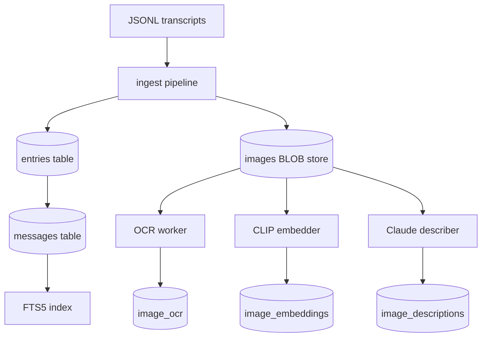

# mnemo ingest pipeline

```mermaid
flowchart TD
  JSONL[JSONL transcripts] --> Ingest[ingest pipeline]
  Ingest --> Entries[(entries table)]
  Entries --> Messages[(messages table)]
  Messages --> FTS[FTS5 index]
  Ingest --> Images[(images BLOB store)]
  Images --> OCR[OCR worker]
  Images --> Embedder[CLIP embedder]
  Images --> Describer[Claude describer]
  OCR --> ImageOCR[(image_ocr)]
  Describer --> ImageDesc[(image_descriptions)]
  Embedder --> ImageVec[(image_embeddings)]
```

This fixture verifies that OCR and embeddings handle diagram-style content
with layered boxes and arrow flows.
