# Targets

## Active

### 🎯T1 Broader memory beyond transcripts
- **Value**: 8
- **Cost**: 13
- **Acceptance**:
  - Data model extends beyond raw transcript messages
  - Decisions, preferences, and project context tracked across sessions
  - Summarisation layer distills sessions into key facts
- **Context**: mnemo evolves from transcript search into a general memory system. T10 (live context compaction) addresses the core. Once T10 achieved, reassess residual scope.
- **Origin**: targets.md bootstrap
- **Status**: Identified
- **Discovered**: 2026-04-07

### 🎯T10 Live context compaction
- **Value**: 10
- **Cost**: 8
- **Acceptance**:
  - Summarizer spawns automatically for active sessions (not for its own sessions)
  - Compacted context available within 2s of mnemo_restore call
  - Compaction survives /clear boundaries within a session
  - Idle reaping cleans up summarizer instances
  - mnemo_restore in fresh post-clear segment returns useful context
  - Token cost of summarizer < 10% of the session it tracks
- **Context**: mnemo maintains a live compacted context for each active session. When a session /clears, the compacted context is available instantly via mnemo_restore. Depends on jevon claude.Process / manager.Manager for Claude instance lifecycle.
- **Origin**: targets.md bootstrap
- **Status**: Identified
- **Discovered**: 2026-04-07

### 🎯T11 Git history indexed cross-repo with FTS and session correlation
- **Value**: 8
- **Cost**: 5
- **Acceptance**:
  - Commits from repos in session_meta indexed automatically
  - mnemo_commits supports cross-repo queries (repo glob, date range)
  - FTS5 index on commit messages enables keyword search across corpus
  - Commit data queryable via mnemo_query (joins with sessions/entries)
  - Incremental — only fetches new commits since last ingest
- **Context**: mnemo knows what was discussed; git history knows what changed. Cross-referencing the two lets agents answer 'why was this changed?' and 'which session produced this commit?' without leaving mnemo.
- **Tags**: ingest, observability
- **Origin**: user suggestion
- **Status**: Identified
- **Discovered**: 2026-04-07

### 🎯T12 GitHub activity (PRs, issues, reviews) indexed cross-repo with FTS and session correlation
- **Value**: 8
- **Cost**: 5
- **Acceptance**:
  - PRs and issues from repos in session_meta indexed automatically
  - mnemo_prs supports cross-repo queries with FTS on title/body
  - PR reviews and comments indexed and searchable
  - Correlated with sessions and commits
  - Queryable via mnemo_query
  - Incremental polling
- **Context**: gh CLI queries one repo at a time. mnemo adds corpus-level FTS search over PRs/issues/reviews and cross-references with session context and git history.
- **Tags**: ingest, observability, github
- **Origin**: user suggestion
- **Status**: Identified
- **Discovered**: 2026-04-07

### 🎯T13 CI/CD run history indexed cross-repo with failure pattern detection
- **Value**: 8
- **Cost**: 3
- **Acceptance**:
  - CI runs from repos in session_meta indexed automatically
  - mnemo_ci supports cross-repo queries with status/conclusion filters
  - Failed run logs indexed with FTS
  - Correlated with commits and sessions
  - Queryable via mnemo_query
  - Incremental polling
- **Context**: GitHub Actions logs are ephemeral (90-day retention) and per-repo. mnemo preserves them permanently and makes them searchable across the full corpus. Would have been useful today for diagnosing CI patterns.
- **Tags**: ingest, observability, ci
- **Origin**: user suggestion
- **Status**: Identified
- **Discovered**: 2026-04-07

### 🎯T5 Self-improving tool discovery
- **Value**: 9
- **Cost**: 8
- **Acceptance**:
  - mnemo_discover_patterns tool identifies workaround sessions
  - Detects direct JSONL reads, grep over transcript dirs, repeated query shapes
  - Output: candidate features with evidence
  - Integrates with template system (T7)
- **Context**: mnemo mines its own transcript index to discover patterns suggesting missing features. Feeds the feedback loop.
- **Origin**: targets.md bootstrap
- **Status**: Identified
- **Discovered**: 2026-04-07

### 🎯T7 Agent-defined query templates
- **Value**: 7
- **Cost**: 8
- **Acceptance**:
  - mnemo_define stores named parameterised query template
  - mnemo_evaluate executes template by name with parameters
  - mnemo_list_templates shows available templates
  - Templates persist in SQLite across sessions
  - mnemo_query nudges agents to define templates for complex queries
- **Context**: Agents can define reusable parameterised query templates that persist across sessions.
- **Origin**: targets.md bootstrap
- **Status**: Identified
- **Discovered**: 2026-04-07

### 🎯T9 Full-fidelity ingest and observability tools
- **Value**: 9
- **Cost**: 8
- **Acceptance**:
  - Field census shows 0 unindexed high-frequency fields (> 1% of entries)
  - mnemo_usage returns daily token breakdown with cost estimates
  - mnemo_permissions suggests concrete allowedTools rules
  - mnemo_who_ran returns session + repo + timestamp
  - mnemo_whatsup correlates system load with session activity
  - mnemo_decisions returns proposal + confirmation with session context
- **Context**: mnemo ingests all JSONL fields (not just user/assistant message content) and exposes observability tools built on the full data. Currently discards ~70% of JSONL data.
- **Origin**: targets.md bootstrap
- **Status**: Identified
- **Discovered**: 2026-04-07

### 🎯T9.3 Permission prompt analysis (mnemo_permissions)
- **Value**: 5
- **Cost**: 3
- **Acceptance**:
  - Identifies most-used tools and frequent approval patterns
  - Suggests concrete allowedTools rules for settings.json
- **Context**: Identify tool approval patterns from tool_use/tool_result pairs. Suggest allowedTools rules. Gates on T9.1.
- **Depends on**: 🎯T9.1
- **Origin**: targets.md bootstrap
- **Status**: Identified
- **Discovered**: 2026-04-07

### 🎯T9.4 Process attribution (mnemo_who_ran)
- **Value**: 5
- **Cost**: 2
- **Acceptance**:
  - mnemo_who_ran returns session + repo + timestamp for a command pattern
  - Matches against tool_command in recent Bash tool_use entries
- **Context**: Given a command pattern, find which session(s) ran it recently. Gates on T9.1.
- **Depends on**: 🎯T9.1
- **Origin**: targets.md bootstrap
- **Status**: Identified
- **Discovered**: 2026-04-07

### 🎯T9.5 System correlation (mnemo_whatsup)
- **Value**: 5
- **Cost**: 5
- **Acceptance**:
  - Correlates current system state with active mnemo sessions
  - Cross-references PIDs and command patterns against recent session activity
- **Context**: Correlate system load (CPU, disk I/O) with active sessions. Gates on T9.1.
- **Depends on**: 🎯T9.1
- **Origin**: targets.md bootstrap
- **Status**: Identified
- **Discovered**: 2026-04-07

### 🎯T9.6 Cross-session decision recall (mnemo_decisions)
- **Value**: 8
- **Cost**: 5
- **Acceptance**:
  - mnemo_decisions searches decisions table by keyword
  - Decision detection heuristic identifies proposal + user confirmation pairs
  - Decisions stored in dedicated FTS5 table
- **Context**: Surface past decisions across all sessions. Detect decision patterns during ingest. Gates on T9.1.
- **Depends on**: 🎯T9.1
- **Origin**: targets.md bootstrap
- **Status**: Identified
- **Discovered**: 2026-04-07

## Achieved

### 🎯T9.2 Token usage analytics (mnemo_usage)
- **Value**: 8
- **Cost**: 3
- **Acceptance**:
  - mnemo_usage returns daily token breakdown with cost estimates
  - Supports daily totals, per-repo breakdown, per-model breakdown
  - Hourly rate detection
- **Context**: Report token consumption by day, repo, session, model with cost estimates. Data comes from message.usage fields. Gates on T9.1 (full-fidelity ingest).
- **Depends on**: 🎯T9.1
- **Origin**: targets.md bootstrap
- **Status**: Achieved
- **Discovered**: 2026-04-07
- **Achieved**: 2026-04-09
- **Actual-cost**: 2

### 🎯T14 File-history-snapshots surfaced as queryable tool
- **Value**: 5
- **Cost**: 2
- **Acceptance**:
  - File-history-snapshot data queryable via dedicated tool or view
  - Cross-session file tracking: which sessions touched this file?
  - Queryable via mnemo_query
  - No additional ingest needed — data already in entries table
- **Context**: 26k+ file-history-snapshot entries already stored in entries table after T9.1. Just needs extraction logic and a tool/view. Low cost, high leverage.
- **Tags**: observability
- **Origin**: user suggestion
- **Status**: Achieved
- **Discovered**: 2026-04-07
- **Achieved**: 2026-04-07

### 🎯T2 Smarter session classification
- **Value**: 5
- **Cost**: 3
- **Acceptance**:
  - Sessions tagged with repo(s) they operated on
  - Sessions tagged with work type (feature, bugfix, review, etc.)
  - Key topics extracted and searchable
  - mnemo_sessions supports filtering by repo and work type
- **Context**: Session classification goes beyond path-based heuristics to understand content and purpose.
- **Origin**: targets.md bootstrap
- **Status**: Achieved
- **Discovered**: 2026-04-07
- **Achieved**: 2026-04-07

### 🎯T3 Active work dashboard data
- **Value**: 8
- **Cost**: 5
- **Acceptance**:
  - mnemo_recent_activity tool returns per-repo summary of recent session activity
  - Output is structured JSON for consumers
  - Configurable recency window (default: 7 days)
- **Context**: mnemo exposes API for cross-referencing recent transcript sessions with external signals to produce unified view of active work.
- **Origin**: targets.md bootstrap
- **Status**: Achieved
- **Discovered**: 2026-04-07
- **Achieved**: 2026-04-07

### 🎯T4 Individual session transcript access
- **Value**: 5
- **Cost**: 3
- **Acceptance**:
  - mnemo_read_session returns messages from a specific session ID
  - Supports filtering by role, offset, limit
  - Works on raw JSONL files, not just indexed database
  - No mutation of transcript files
- **Context**: mnemo can read and search within individual session transcripts. Absorbs jevon transcript_read functionality.
- **Origin**: targets.md bootstrap
- **Status**: Achieved
- **Discovered**: 2026-04-07
- **Achieved**: 2026-04-07

### 🎯T6 Session self-identification
- **Value**: 6
- **Cost**: 5
- **Acceptance**:
  - Agent can retrieve own session messages in a single tool call without knowing session ID
  - Works reliably (not a fragile heuristic)
- **Context**: A session can discover its own transcript and query it via nonce protocol.
- **Origin**: targets.md bootstrap
- **Status**: Achieved
- **Discovered**: 2026-04-07
- **Achieved**: 2026-04-07

### 🎯T8 sqldeep integration
- **Value**: 6
- **Cost**: 5
- **Acceptance**:
  - mnemo_query transparently transpiles sqldeep syntax to SQL
  - Plain SQL continues to work unchanged
  - sqldeep JSON helper functions registered on SQLite connection
  - Tool description documents available syntax
- **Context**: mnemo_query accepts sqldeep syntax in addition to plain SQL.
- **Origin**: targets.md bootstrap
- **Status**: Achieved
- **Discovered**: 2026-04-07
- **Achieved**: 2026-04-07

### 🎯T9.1 Full-fidelity ingest
- **Value**: 8
- **Cost**: 5
- **Acceptance**:
  - All top-level JSONL fields and message sub-fields ingested
  - usage, model, stop_reason, version, slug, agentId stored
  - Full entry stored as JSONB where practical
  - Virtual columns for high-query fields
  - Schema version bump with full re-index
- **Context**: Ingest all top-level JSONL fields and message sub-fields. Currently ~70% of data is discarded.
- **Origin**: targets.md bootstrap
- **Status**: Achieved
- **Discovered**: 2026-04-07
- **Achieved**: 2026-04-07

## Graph

```mermaid
graph TD
    T1["Broader memory beyond transcr…"]
    T10["Live context compaction"]
    T11["Git history indexed cross-rep…"]
    T12["GitHub activity (PRs, issues,…"]
    T13["CI/CD run history indexed cro…"]
    T5["Self-improving tool discovery"]
    T7["Agent-defined query templates"]
    T9["Full-fidelity ingest and obse…"]
    T9_3["Permission prompt analysis (m…"]
    T9_4["Process attribution (mnemo_wh…"]
    T9_5["System correlation (mnemo_wha…"]
    T9_6["Cross-session decision recall…"]
```

