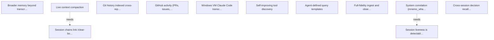

# Targets

## Active

### 🎯T1 Broader memory beyond transcripts
- **Value**: 8
- **Cost**: 13
- **Acceptance**:
  - Data model extends beyond raw transcript messages
  - Decisions, preferences, and project context tracked across sessions
  - Summarisation layer distills sessions into key facts
- **Context**: mnemo evolves from transcript search into a general memory system. T10 (live context compaction) addresses the core. Once T10 achieved, reassess residual scope.
- **Origin**: targets.md bootstrap
- **Status**: Identified
- **Discovered**: 2026-04-07

### 🎯T10 Live context compaction
- **Value**: 10
- **Cost**: 8
- **Acceptance**:
  - Summarizer spawns automatically for active sessions (not for its own sessions)
  - Compacted context available within 2s of mnemo_restore call
  - Compaction survives /clear boundaries within a session
  - Idle reaping cleans up summarizer instances
  - mnemo_restore in fresh post-clear segment returns useful context
  - Token cost of summarizer < 10% of the session it tracks
- **Context**: mnemo maintains a live compacted context for each active session. When a session /clears, the compacted context is available instantly via mnemo_restore. Depends on jevon claude.Process / manager.Manager for Claude instance lifecycle.
- **Depends on**: 🎯T16
- **Origin**: targets.md bootstrap
- **Status**: Identified
- **Discovered**: 2026-04-07

### 🎯T11 Git history indexed cross-repo with FTS and session correlation
- **Value**: 8
- **Cost**: 5
- **Acceptance**:
  - Commits from repos in session_meta indexed automatically
  - mnemo_commits supports cross-repo queries (repo glob, date range)
  - FTS5 index on commit messages enables keyword search across corpus
  - Commit data queryable via mnemo_query (joins with sessions/entries)
  - Incremental — only fetches new commits since last ingest
- **Context**: mnemo knows what was discussed; git history knows what changed. Cross-referencing the two lets agents answer 'why was this changed?' and 'which session produced this commit?' without leaving mnemo.
- **Tags**: ingest, observability
- **Origin**: user suggestion
- **Status**: Identified
- **Discovered**: 2026-04-07

### 🎯T12 GitHub activity (PRs, issues, reviews) indexed cross-repo with FTS and session correlation
- **Value**: 8
- **Cost**: 5
- **Acceptance**:
  - PRs and issues from repos in session_meta indexed automatically
  - mnemo_prs supports cross-repo queries with FTS on title/body
  - PR reviews and comments indexed and searchable
  - Correlated with sessions and commits
  - Queryable via mnemo_query
  - Incremental polling
- **Context**: gh CLI queries one repo at a time. mnemo adds corpus-level FTS search over PRs/issues/reviews and cross-references with session context and git history.
- **Tags**: ingest, observability, github
- **Origin**: user suggestion
- **Status**: Identified
- **Discovered**: 2026-04-07

### 🎯T15 Windows VM Claude Code transcripts are indexed in realtime alongside macOS sessions
- **Value**: 8
- **Cost**: 5
- **Acceptance**:
  - ~/.mnemo/config.json supports extra_project_dirs with paths to additional Claude Code project directories
  - mnemo ingests JSONL transcripts from configured extra dirs at startup
  - A Windows stub app watches the local Claude projects dir and notifies mnemo of changes via pigeon
  - mnemo receives pigeon notifications and ingests the corresponding files from the SMB mount path
  - mnemo_search and mnemo_sessions return results from both macOS and Windows sessions
  - Graceful degradation when the VM/mount is unavailable — no crashes, warns in log, skips unavailable dirs
- **Context**: The user runs Claude Code on both macOS and a Parallels Windows 11 VM. The Windows filesystem is accessible via SMB mount at ~/winc/. Currently mnemo only indexes ~/.claude/projects/ (macOS-local). Windows session transcripts at ~/winc/Users/marcelo/.claude/projects/ are invisible to mnemo. A config file (~/.mnemo/config.json) specifies extra project directories. A small Windows stub app watches %USERPROFILE%\.claude\projects\ using ReadDirectoryChangesW and sends change notifications to mnemo via pigeon (marcelocantos/pigeon WebTransport relay). mnemo listens for pigeon notifications and ingests the changed files from the SMB mount. The config must gracefully handle VM unavailability (mount not present). fsnotify does not work over SMB, so native Windows notification + pigeon relay is the chosen approach.
- **Tags**: ingest, cross-platform, pigeon
- **Origin**: conversation: user wants unified transcript search across macOS and Windows VM environments
- **Status**: Identified
- **Discovered**: 2026-04-09

### 🎯T16 Session chains link /clear-bounded transcripts into work spans
- **Value**: 8
- **Cost**: 5
- **Acceptance**:
  - Schema: session_chains(successor_id PK, predecessor_id, boundary, gap_ms, confidence, mechanism, detected_at) with index on predecessor_id
  - Ingest-time detection: when a new JSONL's first non-meta user event contains <command-name>/clear</command-name>, look for a predecessor in the same project directory whose last event precedes the new file's first event; insert the link with confidence bucketed as high (<2s), medium (2-5s), or none (>5s, no link recorded but boundary noted)
  - Retroactive backfill: a one-shot routine runs the same detection against all already-ingested sessions on first startup after the schema change
  - Query API on Store: Predecessor(sid), Successor(sid), Chain(sid) []string (oldest to newest)
  - RPC exposure: Chain method reachable via the daemon socket
  - MCP tool mnemo_chain: given any session ID in a chain, returns the full chain with per-session previews
  - agents-guide.md: new section documenting /clear rollover behaviour and how to traverse session chains
  - STABILITY.md: new table, methods, and MCP tool catalogued
  - Tests: unit coverage for detection (clean rollover, gap too large, no predecessor, same cwd with multiple candidates) plus a fixture-based integration test against sample JSONLs
- **Context**: Claude Code's /clear command creates a brand-new JSONL file with a fresh session UUID rather than preserving the current session ID. Verified 2026-04-12 against claude v2.1.101: successor-session first event was 331ms after predecessor last event, same physical claude process, new JSONL path. This also matches an earlier cworkers empirical check from March 2026 — the rollover behaviour has been consistent across releases. A later (April 2026) investigation wrongly concluded the opposite; that finding is superseded and a claudia-side reference memory now captures the correct behaviour.

Mnemo's shipped code is unaffected because its ingest is already session-ID-agnostic — each .jsonl file is a distinct session, fsnotify picks up new files via directory watches, and nothing depends on session-ID stability across /clear. But any higher-level concept of "a work span" (summarisation, context restoration, recent-activity narratives, mnemo_restore) needs to traverse the chain of /clear-bounded sessions that together make up a conceptual work unit. This target establishes session_chains as the mnemo-level primitive for that traversal.

The linkage heuristic is time-based: same project directory, first non-meta user event is a /clear command marker, gap to the predecessor's last event <= 5 seconds. Verified against 12 post-/clear sessions in the doit project dir: 4 of 12 had rollover gaps under 2s (unambiguous links), the rest were fresh Claude Code sessions where the user habitually typed /clear at the start (gap ranges from 8s to 6+ hours). The 2s/5s threshold cleanly separates the two cases in observed data.

The heuristic works retroactively because mnemo captures everything it needs (per-session first/last timestamps, project dir, first user event content) — backfill just iterates existing rows. No real-time PID tracking required; the lsof-based approach was considered and rejected (lsof is a snapshot tool, Claude Code doesn't keep the JSONL open between writes, so lsof polling can't observe the transition). If deterministic PID-anchored linkage is needed later, the schema's `mechanism` column accommodates it without breaking existing rows.

Scope is linkage only. Downstream consumers (summarisation, restore, cross-span search) build on top and are separate targets — in particular T10 "Live context compaction" depends on this because its current acceptance criteria assume a session's identity survives /clear, which it doesn't. T10 should be reframed to use session_chains as its traversal mechanism once this target is achieved.
- **Tags**: ingest, schema, claude-code
- **Status**: Identified
- **Discovered**: 2026-04-12

### 🎯T5 Self-improving tool discovery
- **Value**: 9
- **Cost**: 8
- **Acceptance**:
  - mnemo_discover_patterns tool identifies workaround sessions
  - Detects direct JSONL reads, grep over transcript dirs, repeated query shapes
  - Output: candidate features with evidence
  - Integrates with template system (T7)
- **Context**: mnemo mines its own transcript index to discover patterns suggesting missing features. Feeds the feedback loop.
- **Origin**: targets.md bootstrap
- **Status**: Identified
- **Discovered**: 2026-04-07

### 🎯T7 Agent-defined query templates
- **Value**: 7
- **Cost**: 8
- **Acceptance**:
  - mnemo_define stores named parameterised query template
  - mnemo_evaluate executes template by name with parameters
  - mnemo_list_templates shows available templates
  - Templates persist in SQLite across sessions
  - mnemo_query nudges agents to define templates for complex queries
- **Context**: Agents can define reusable parameterised query templates that persist across sessions.
- **Origin**: targets.md bootstrap
- **Status**: Identified
- **Discovered**: 2026-04-07

### 🎯T9 Full-fidelity ingest and observability tools
- **Value**: 9
- **Cost**: 8
- **Acceptance**:
  - Field census shows 0 unindexed high-frequency fields (> 1% of entries)
  - mnemo_usage returns daily token breakdown with cost estimates
  - mnemo_permissions suggests concrete allowedTools rules
  - mnemo_who_ran returns session + repo + timestamp
  - mnemo_whatsup correlates system load with session activity
  - mnemo_decisions returns proposal + confirmation with session context
- **Context**: mnemo ingests all JSONL fields (not just user/assistant message content) and exposes observability tools built on the full data. Currently discards ~70% of JSONL data.
- **Origin**: targets.md bootstrap
- **Status**: Identified
- **Discovered**: 2026-04-07

### 🎯T9.5 System correlation (mnemo_whatsup)
- **Value**: 5
- **Cost**: 3
- **Acceptance**:
  - For each live session (as identified by 🎯T9.5.1), mnemo can report current CPU, RSS, and IO metrics for the owning claude process
  - System load (system-wide CPU, memory pressure, disk I/O) is reported alongside per-session metrics so the user can see whether a slow session is caused by the session itself or by contention
  - Results are surfaced as a mnemo_whatsup tool that answers "which of my active sessions is doing expensive work right now"
  - Cross-references PIDs and command patterns against recent session activity
- **Context**: Correlate system load (CPU, RSS, disk I/O) with live sessions. Answers "which of my active sessions is hogging resources right now". Depends on 🎯T9.5.1 (session liveness detection) to identify which sessions are alive; this target then layers per-process and per-system metrics onto that. On macOS: `ps -o pid,rss,%cpu,time -p <pid>` for per-process, `vm_stat` / `iostat` for system-wide. On Linux: /proc/<pid>/stat, /proc/loadavg. Gates on 🎯T9.1 (full-fidelity ingest) for session data and 🎯T9.5.1 (session liveness) for the "which sessions are live" question. Scope was narrowed on 2026-04-11: the liveness detection portion was forked out to 🎯T9.5.1 since it's independently useful.
- **Depends on**: 🎯T9.1, 🎯T9.5.1
- **Origin**: targets.md bootstrap
- **Status**: Identified
- **Discovered**: 2026-04-07

### 🎯T9.5.1 Session liveness is detectable — mnemo can report which session IDs have an active Claude Code process running them
- **Value**: 8
- **Cost**: 2
- **Acceptance**:
  - mnemo can report, for any given session ID, whether a Claude Code process currently has its transcript JSONL file open
  - Liveness is surfaced as an annotation on session listings (mnemo_sessions, mnemo_status) and/or a dedicated lookup tool
  - A single lsof invocation can annotate many sessions at once, for acceptable cost on listings with dozens of sessions
  - Correctly distinguishes idle-but-alive sessions (user AFK) from dead sessions (process exited)
- **Context**: Claude Code keeps the transcript JSONL file (~/.claude/projects/<project>/<session-id>.jsonl) open for writing throughout a session's lifetime, even when idle. `lsof` on the file path is therefore an authoritative liveness signal. Batch form: `lsof -c claude -a +D ~/.claude/projects/` lists every JSONL opened by any claude process in one call, which can be parsed into a sessionID→PID map and cached briefly for annotation of listings. Prerequisite for T9.5 (system correlation / mnemo_whatsup). Also independently valuable on its own — "which sessions are running right now" is a frequent standalone question.
- **Depends on**: 🎯T9.1
- **Tags**: observability, sessions
- **Origin**: forked from T9.5 during scope refinement 2026-04-11
- **Status**: Identified
- **Discovered**: 2026-04-11

### 🎯T9.6 Cross-session decision recall (mnemo_decisions)
- **Value**: 8
- **Cost**: 5
- **Acceptance**:
  - mnemo_decisions searches decisions table by keyword
  - Decision detection heuristic identifies proposal + user confirmation pairs
  - Decisions stored in dedicated FTS5 table
- **Context**: Surface past decisions across all sessions. Detect decision patterns during ingest. Gates on T9.1.
- **Depends on**: 🎯T9.1
- **Origin**: targets.md bootstrap
- **Status**: Identified
- **Discovered**: 2026-04-07

## Achieved

### 🎯T17 ⦿ Every mnemo stream self-heals on startup — no agent should need to know whether a given mnemo_* tool has seen the whole corpus
- **Value**: 8
- **Cost**: 5
- **Observable**: true
- **Acceptance**:
  - Every repo-level stream (targets, audit logs, plans, CI runs) performs a filesystem-walk backfill on daemon startup, not a session_meta-seeded scan
  - Backfill discovers repos from a configurable set of workspace roots (default: ~/work) plus any repos already known from session_meta — the union, not just one
  - On daemon startup after a period of being down, mnemo re-scans every stream's corpus and ingests anything that changed while it was stopped (mtime > last_ingest, or content-hash mismatch)
  - mnemo_status reports, per stream, a 'last full backfill' timestamp and a 'coverage' count so agents can see at a glance whether the stream is complete
  - A new mnemo_stats-style breakdown shows, for each stream, how many files are indexed vs how many exist on disk under the configured roots — non-zero drift is surfaced, not hidden
  - Documentation in agents-guide.md states the invariant plainly: 'mnemo_* tools reflect the full on-disk corpus at the time of the last query; agents do not need to reason about whether the index is stale'
  - Tests: for each repo-level stream, a regression test that creates a repo with the relevant artefact on disk, starts a fresh store (no session_meta), runs backfill, and asserts the artefact is searchable
- **Context**: Discovered 2026-04-12 from a parallel bullseye session that ran a cross-repo targets report and got only 5 repos back. Root cause: mnemo_targets — like mnemo_audit, mnemo_plans, and mnemo_ci — uses `IngestTargets`, which enumerates repos from session_meta (store.go:1718). Any repo with a targets.yaml on disk but no recent indexed session is invisible to the tool. Transcripts, memories, and skills do not have this problem because IngestAll / IngestMemories / IngestSkills walk the filesystem directly.

The user's principle: "agents shouldn't have to figure out when mnemo can and can't be relied on". Right now, every agent that uses mnemo_targets / mnemo_audit / mnemo_plans / mnemo_ci has to know that these tools silently omit repos they haven't seen via sessions, and has to fall back to Glob + filesystem walks. This is exactly the kind of correctness footgun that burns agent-hours and erodes trust in the tool.

The fix has two halves:

1. **Startup backfill**: each repo-level stream needs a filesystem walker that discovers artefacts under a configured workspace root (default ~/work), independent of session_meta. Session_meta can still contribute (for repos outside the root), but it is no longer the sole source of truth. The walker should use the same incremental-by-mtime logic that transcript ingest already uses so that restart-after-downtime is cheap.

2. **Downtime catchup**: commit ac93bc6 added fsnotify watchers for these paths, but only for repos the daemon already knows about. If mnemo is stopped, a targets.yaml is edited, and mnemo restarts, the fsnotify-based path misses the change. The backfill walker closes this gap because it runs on every startup.

Scope covers: IngestTargets (targets), IngestAuditLogs (audit), IngestPlans (plans), the CI ingest path, and any future repo-level stream. Out of scope: transcript/memory/skill streams (already correct). Also out of scope: real-time discovery of brand-new repos created while mnemo is running — fsnotify on the workspace root would handle that, but it's a separate target.

This target is marked observable because the coverage drift metric in mnemo_status is the human-visible checkpoint.
- **Tags**: ingest, correctness, cross-repo
- **Status**: Achieved
- **Discovered**: 2026-04-12
- **Achieved**: 2026-04-12
- **Actual-cost**: 5

### 🎯T13 CI/CD run history indexed cross-repo with failure pattern detection
- **Value**: 8
- **Cost**: 3
- **Acceptance**:
  - CI runs from repos in session_meta indexed automatically
  - mnemo_ci supports cross-repo queries with status/conclusion filters
  - Failed run logs indexed with FTS
  - Correlated with commits and sessions
  - Queryable via mnemo_query
  - Incremental polling
- **Context**: GitHub Actions logs are ephemeral (90-day retention) and per-repo. mnemo preserves them permanently and makes them searchable across the full corpus. Would have been useful today for diagnosing CI patterns.
- **Tags**: ingest, observability, ci
- **Origin**: user suggestion
- **Status**: Achieved
- **Discovered**: 2026-04-07
- **Achieved**: 2026-04-10
- **Actual-cost**: 3

### 🎯T9.3 Permission prompt analysis (mnemo_permissions)
- **Value**: 5
- **Cost**: 3
- **Acceptance**:
  - Identifies most-used tools and frequent approval patterns
  - Suggests concrete allowedTools rules for settings.json
- **Context**: Identify tool approval patterns from tool_use/tool_result pairs. Suggest allowedTools rules. Gates on T9.1.
- **Depends on**: 🎯T9.1
- **Origin**: targets.md bootstrap
- **Status**: Achieved
- **Discovered**: 2026-04-07
- **Achieved**: 2026-04-10
- **Actual-cost**: 3

### 🎯T9.4 Process attribution (mnemo_who_ran)
- **Value**: 5
- **Cost**: 2
- **Acceptance**:
  - mnemo_who_ran returns session + repo + timestamp for a command pattern
  - Matches against tool_command in recent Bash tool_use entries
- **Context**: Given a command pattern, find which session(s) ran it recently. Gates on T9.1.
- **Depends on**: 🎯T9.1
- **Origin**: targets.md bootstrap
- **Status**: Achieved
- **Discovered**: 2026-04-07
- **Achieved**: 2026-04-10
- **Actual-cost**: 2

### 🎯T9.2 Token usage analytics (mnemo_usage)
- **Value**: 8
- **Cost**: 3
- **Acceptance**:
  - mnemo_usage returns daily token breakdown with cost estimates
  - Supports daily totals, per-repo breakdown, per-model breakdown
  - Hourly rate detection
- **Context**: Report token consumption by day, repo, session, model with cost estimates. Data comes from message.usage fields. Gates on T9.1 (full-fidelity ingest).
- **Depends on**: 🎯T9.1
- **Origin**: targets.md bootstrap
- **Status**: Achieved
- **Discovered**: 2026-04-07
- **Achieved**: 2026-04-09
- **Actual-cost**: 2

### 🎯T14 File-history-snapshots surfaced as queryable tool
- **Value**: 5
- **Cost**: 2
- **Acceptance**:
  - File-history-snapshot data queryable via dedicated tool or view
  - Cross-session file tracking: which sessions touched this file?
  - Queryable via mnemo_query
  - No additional ingest needed — data already in entries table
- **Context**: 26k+ file-history-snapshot entries already stored in entries table after T9.1. Just needs extraction logic and a tool/view. Low cost, high leverage.
- **Tags**: observability
- **Origin**: user suggestion
- **Status**: Achieved
- **Discovered**: 2026-04-07
- **Achieved**: 2026-04-07

### 🎯T2 Smarter session classification
- **Value**: 5
- **Cost**: 3
- **Acceptance**:
  - Sessions tagged with repo(s) they operated on
  - Sessions tagged with work type (feature, bugfix, review, etc.)
  - Key topics extracted and searchable
  - mnemo_sessions supports filtering by repo and work type
- **Context**: Session classification goes beyond path-based heuristics to understand content and purpose.
- **Origin**: targets.md bootstrap
- **Status**: Achieved
- **Discovered**: 2026-04-07
- **Achieved**: 2026-04-07

### 🎯T3 Active work dashboard data
- **Value**: 8
- **Cost**: 5
- **Acceptance**:
  - mnemo_recent_activity tool returns per-repo summary of recent session activity
  - Output is structured JSON for consumers
  - Configurable recency window (default: 7 days)
- **Context**: mnemo exposes API for cross-referencing recent transcript sessions with external signals to produce unified view of active work.
- **Origin**: targets.md bootstrap
- **Status**: Achieved
- **Discovered**: 2026-04-07
- **Achieved**: 2026-04-07

### 🎯T4 Individual session transcript access
- **Value**: 5
- **Cost**: 3
- **Acceptance**:
  - mnemo_read_session returns messages from a specific session ID
  - Supports filtering by role, offset, limit
  - Works on raw JSONL files, not just indexed database
  - No mutation of transcript files
- **Context**: mnemo can read and search within individual session transcripts. Absorbs jevon transcript_read functionality.
- **Origin**: targets.md bootstrap
- **Status**: Achieved
- **Discovered**: 2026-04-07
- **Achieved**: 2026-04-07

### 🎯T6 Session self-identification
- **Value**: 6
- **Cost**: 5
- **Acceptance**:
  - Agent can retrieve own session messages in a single tool call without knowing session ID
  - Works reliably (not a fragile heuristic)
- **Context**: A session can discover its own transcript and query it via nonce protocol.
- **Origin**: targets.md bootstrap
- **Status**: Achieved
- **Discovered**: 2026-04-07
- **Achieved**: 2026-04-07

### 🎯T8 sqldeep integration
- **Value**: 6
- **Cost**: 5
- **Acceptance**:
  - mnemo_query transparently transpiles sqldeep syntax to SQL
  - Plain SQL continues to work unchanged
  - sqldeep JSON helper functions registered on SQLite connection
  - Tool description documents available syntax
- **Context**: mnemo_query accepts sqldeep syntax in addition to plain SQL.
- **Origin**: targets.md bootstrap
- **Status**: Achieved
- **Discovered**: 2026-04-07
- **Achieved**: 2026-04-07

### 🎯T9.1 Full-fidelity ingest
- **Value**: 8
- **Cost**: 5
- **Acceptance**:
  - All top-level JSONL fields and message sub-fields ingested
  - usage, model, stop_reason, version, slug, agentId stored
  - Full entry stored as JSONB where practical
  - Virtual columns for high-query fields
  - Schema version bump with full re-index
- **Context**: Ingest all top-level JSONL fields and message sub-fields. Currently ~70% of data is discarded.
- **Origin**: targets.md bootstrap
- **Status**: Achieved
- **Discovered**: 2026-04-07
- **Achieved**: 2026-04-07

## Graph

